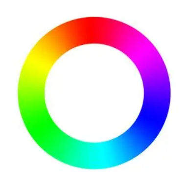
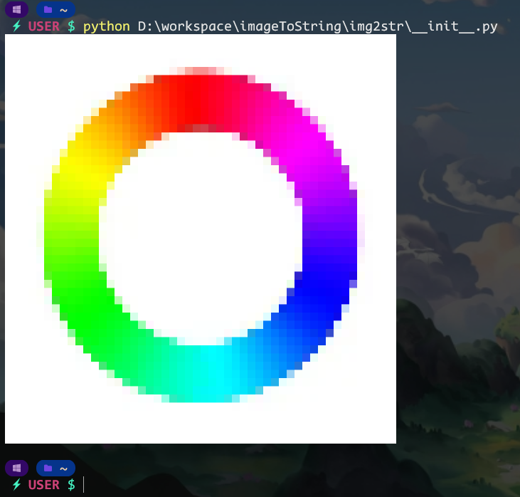

# Image to String  图片转ANSI字符串工具

将图片转化为ansi字符串  
灵感来源：[https://github.com/JonnoFTW/img_term](https://github.com/JonnoFTW/img_term)  

---

## 下载

```bash
pip install image2str
```

---

## 特殊说明

请使用可以显示ansi字符串并且可以显示TrueColor的终端运行（例如：[WindowsTerminal](https://github.com/microsoft/terminal)）

---

## 函数介绍

### `image2String(imageSrc, newSize=None)`

将图片路径 / url类转为ansi字符串

   参数：  
   imageSrc: 图片路径（字符串）或者图片url（`img2str.url`类）  
   newSize: 转化后的图片大小（输入`None`即为自动填充）  
   返回值：处理过后的字符串  

   例  

   ```python
   image2String("readme-images/colortest.png", newSize=(50,50))
   ```

     
   将会转变到  
     

   或是  

   ```python
   image2String(url("https://i0.hdslb.com/bfs/article/03245d65e35b7573b6988c26a2a037903ef92896.png"), newSize=None)
   ```  

     
   转变到  
     

### `Mat2String(imageSrc, size=None)`

将opencv的图像转为的`cv2.Mat`类型转为ansi字符串（返回值与`image2String(imageSrc, newSize=None)`效果相同）
