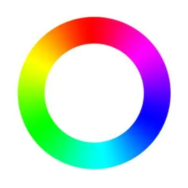

# Image to String

Convert image to ANSI string
The inspiration comes from here: [https://github.com/JonnoFTW/img_term](https://github.com/JonnoFTW/img_term)  

---

[简体中文README](./README.cn.md)

---

## Installation

```bash
pip install image2str
```

---

## Note

Please use a terminal that can display ANSI strings and TrueColor to run (example: [WindowsTerminal](https://github.com/microsoft/terminal))

---

## Functions

### `image2String(imageSrc, newSize=None)`

Convert image path / `img2str.url` class to ANSI string

   parameters:&nbsp;  
   imageSrc: image path(str) or image url(`img2str.url`)  
   newSize: Target image size(auto resize by value `None`)  

   return: string after transforming  

   example:  

   ```python
   image2String("readme-images/colortest.png", newSize=(50,50))
   ```

   will from this
     
   to this  
     

   or this  

   ```python
   image2String(url("https://i0.hdslb.com/bfs/article/03245d65e35b7573b6988c26a2a037903ef92896.png"), newSize=None)
   ```  

     
   to this  
     

### `Mat2String(imageSrc, size=None)`

   tranform class `mat.cv2` to ANSI string (Usage is similar to `image2String(imageSrc, newSize=None)`)
